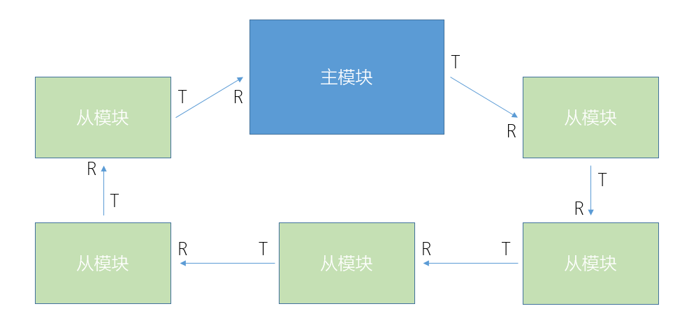
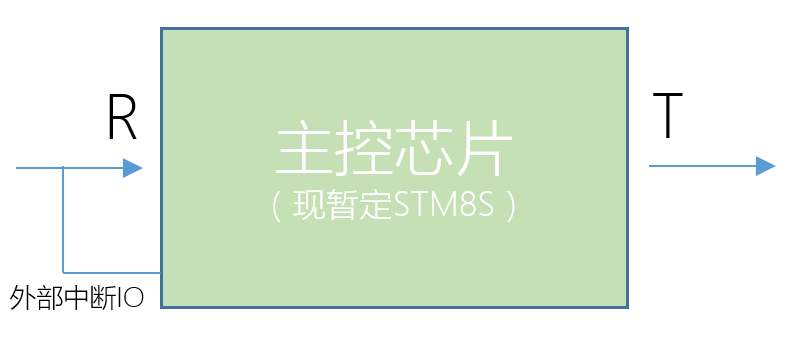

#有关狗项圈主从模块间的通信协议

##硬件构成

狗项圈主从模块的主要通信拓扑参考环形网络，即数据传输为单方向传输，采用串口进行数据收发，示意图如下：

考虑到模块的低功耗要求，在硬件上应注意其外部中断设计不应单独占用一路信号线，故规定信号线连接从模块的主控芯片的两个引脚，一为R（串口接收），另一为能够触发其外部中断，从最低功耗模式进入正常工作模式，为简化接口设计，触发信号统一采用串口协议中的起始位实现的电平翻转触发跳变沿中断，同时规定唤醒命令为0X00（配合串口的起始位与结束位即为9位0，形成足够长时间的低电平脉冲信号）。如下图：

##通信协议
###通信的建立

该网络拓扑主要用于解决未知环状网络的确定化问题，即对于主从模块而言，第一次上电后互为未知状态（主模块不知道有多少从模块、有什么从模块以及这些从模块在网络中的具体位置，即地址；从模块未知自身的位置）。故建立通信的第一步应解决这些未知的问题。

上电结束后，主模块发出第一个命令即为唤醒命令（初始化命令）。从模块收到后立刻将这个命令传递给下一个从模块（考虑到从模块不一定是真正意义上的“收到”这个唤醒命令，从模块被唤醒后的第一件事就是发送一个唤醒命令给自己下一个从模块）。主模块从发送唤醒命令后开始计时，在某个确定的时间内（根据实际情况确定的一个合适的时间）收到返回的唤醒命令，即视为环路正常建立，反之则报错，并发送错误信息到手机或点亮报错LED等。

确认环路建立后，主模块需要确认从模块的数量、种类和具体位置。主模块发送地址初始化命令0XC0（高两位表示状态，11表示地址初始化），从模块收到后，在收到内容的基础上加一再发送给下一从模块。如：主模块发出0XC0，第一个从模块收到后将自身的地址定义为0X01，然后发送0XC1到下一个从模块，第二个从模块收到0XC1，将自身的地址定义为0X02，然后发送0XC2到下一个从模块，以此类推。主模块最终将收到一个确定的数字，如0XCF，可知当前环路中有15个从模块。

地址初始化完成后，主模块发送请求设备描述命令。从模块接到命令之后以数据的形式直接返回规定的设备类型即可。

至此，此通信网络建立完成。

###通信的模式

命令格式如下：

    FF：当前数据类型
    00：地址
    01：命令
    10：数据
    11：初始化命令

    NN：需要传输的数据的第几个4bit（地址除外）。例如：
    01 00 0110 表示命令的0~3位为 0110 ；
    10 11 0111 表示数据的12~15位为 0111 ；
    00 00 1010 表示地址为01010 ；
    00 10 0011 表示为地址为00011的从模块发回的ACK或中断请求。地址中第6位表示是否ACK信号。（统一表示为左高右低）

    DDDD：4bit的数据

    （所谓的唤醒命令实际上是发往地址为0 的设备的，也就是主模块自身。）
    
通信协议的大原则为：主模块发送对应的地址、命令和数据，从模块根据被点名与否决定是否传递数据。总体顺序为：

    1、主模块发送地址，从模块对应判断自身是否被点名了（即收到的这个地址是否指的自身），是则准备好接收命令和收发数据，否则进入透传模式（直接将收到的数据转发到下一个从模块）。其它模块则统一进入透传模式；
    2、主模块发送命令修改被点名模块的工作状态或要求从模块返回相关的数据；
    3、主模块发送或接受具体数据；
    4、如果需要对其它从模块进行操作，直接开始下一轮点名即可。若连续读取相关数值（如健康模块的监控数据），重复命令即可。

在确认环路通信建立、地址列表建立完成的前提下，主模块开始逐个地址发送命令请求从模块的设备描述。从模块收到请求设备描述命令的时候就以数据的方式将自身的设备类型发回主模块。至此，整个网络中的所有从模块的地址和对应的设备类型已经在主模块的地址列表中了，可进行下一步操作。

###在收到主模块的相关命令时，被点名的从模块应该回复一个对应的ACK（ACK命令二进制表示为00+对应从模块的地址）到主模块以确认接收正常并继续等待下一条指令。

###在从模块不工作的时候可以通过命令来使整个网络进入休眠模式，可以通过在从模块中规定一个特殊命令，自身接收到这个命令，转发完成后即进入休眠模式。也可以在现有的框架下规定一个普通的休眠命令，从环形网络末端的从模块开始点名休眠。

##相关过程示例如下（为便于描述，统一规定系统环境为主模块+3个从模块）

###所有模块上电后（可以是第一次上电，也可以是重启后或通信出现错误时重新初始化），所有从模块默认进入等待命令的空闲模式，此时主模块应重新建立从模块地址列表：

    所有模块启动完成后，主模块发出地址初始化命令0XC0到从模块A（以下简称从A，以此类推）；
    从A收到0XC0，根据高位判断得出此为初始化命令，将自身地址设为0X1，并发送命令0XC1到从B；
    从B收到0XC1，同样根据地址初始化流程，将自身地址设为0X2，并向从C发送命令0XC2;
    从C收到0XC2,设置自身地址为0X3，并继续向下发送0XC4；
    主模块收到最后一个从模块发来的0XC4，确认当前系统中有（4-1）个从模块，从A、从B、从C的地址分别为0X1、0X2、0X3，地址初始化结束。

###初始化后主模块请求各个从模块上传设备描述：

    主模块发起点名，发送0X01，点名从A；
    从A收到0X01，判断此为地址命令并且与初始化所设地址一致，故停止将此命令转发到下一个从模块，转而发送ACK信号0X21，点名标志位置位，并等待下一条命令；
    从B、从C收到0X21，判断此命令与自身无关，直接转发，最终主模块收到了从A的ACK信号，确认从A已经被点名；
    主模块发送请求设备描述命令0X40（请求设备描述的命令为0000）；
    从A收到0X40后，先发送ACK信号0X21，然后按照协议返回对应的设备类型代码，例如0X3B，即分别发送0X93, 0X8B，之后从A清零点名标志位;
    从B、从C直接转发，最终主模块收到了从A的设备描述0X3B。

###主模块向从模块发送一个无返回命令（例如设置从B的LED的亮度）

    主模块发起点名，发送命令0X02，点名从B，从B置位对应点名标志位；
    从A直接转发该命令，从B收到命令后回复ACK信号0X22；
    从C直接转发，主模块收到从B的ACK，然后发送设置LED亮度的命令（设置占空比）0XC6，即连续发送0X5C 0X46；
    从B收到0X5C 0X46后处理得出命令为0XC6，返回ACK；
    主模块收到ACK，发送数据0X47，即连续发送0X94 0X87；
    从B收到0X94 0X87处理得到0X47，发送ACK，设置占空比，点名标志位清零，命令完成。

###主模块向从模块发送一个有返回命令（例如从C读取气温）

    主模块发起点名，发送地址命令0X03，点名从C，点名标志位置位；
    从A、从B直接转发，从C收到命令后回复ACK信号0X23；
    主模块收到ACK后发送读取温度的命令0XFA，即连续发送0X5F 0X4A；
    从C收到后处理得出命令为0XFA，回复ACK，并且回复16bit数据0X78A3,即连续发送0XB7 0XA8 0X9A 0X83，并且清零点名标志位；
    主模块处理后得到数据，命令完成；

###从模块发起数据处理请求，主模块处理（例如温度异常）

    从C检测到异常温度变化，发送ACK命令0X23，置位点名标志位和异常标志位；
    主模块接收到从C的ACK，发送查询异常命令0X4F；
    从C收到异常查询命令，回复ACK信号，并回复对应异常代码0XFA和异常数据0XFFFA，即连续发送0X5F 0X4A 0XBF 0XAF 0X9F 0X8A；
    主模块收到异常代码与异常数据后重新发送清除异常指令0X5A 0X4A；
    从C收到指令后回复ACK信号，清除异常标志位和点名标志位，命令完成。
